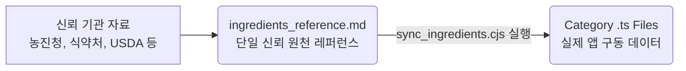

# 🛡️ FreshSnap 식재료 데이터 관리 아키텍처 및 동기화 가이드

본 디렉토리(`src/data/ingredients/`) 하위의 카테고리별 `.ts` 파일은 FreshSnap 앱의 보관 가이드라인 원천 데이터입니다. 데이터의 신뢰성 확보와 일관된 유지보수를 위해 본 프로젝트는 **단일 신뢰 원천(SSOT - Single Source of Truth)** 설계 방식을 따릅니다.

---

## 🔄 데이터 흐름도



1. **원천 정보 수집**: 국내외 공신력 있는 식품 안전 및 농업 기술 기관의 오리지널 고시, 보도자료, 연구서 기준 조사.
2. **레퍼런스 자산화**: [ingredients_reference.md](file:///Users/soulhammer/projects/selalink-website/v3-app/src/data/ingredients_reference.md)에 가독성 높은 마크다운 표 형태로 보관법, 손질법, 주의사항, 정확한 신뢰 출처 정리.
3. **앱 데이터 동기화**: 자동화 스크립트를 통해 레퍼런스로부터 수치와 출처를 파싱하여 실제 `.ts` 소스 코드에 안전하게 주입.

---

## 🛠️ 신규 식재료 추가 및 보관 정보 업데이트 프로세스

향후 새로운 식재료를 추가하거나 기존 식재료의 보관 수칙을 업데이트할 때, 반드시 아래의 **3단계 프로세스**를 준수해야 합니다.

### 1단계: 레퍼런스 파일 반영
* [ingredients_reference.md](file:///Users/soulhammer/projects/selalink-website/v3-app/src/data/ingredients_reference.md)에 신규 식재료 행을 추가하거나 기존 행의 수치 및 출처를 갱신합니다.
* 식재료의 ID는 괄호 안에 고유 영문 ID로 적어야 하며, 행의 마지막 열에 콤마로 구분된 출처 리스트를 기재합니다.
  * *예시: `| **블루베리**<br>(blueberry) | ... | **냉장(7일)** ... | ... | USDA, RDA |`*

### 2단계: 동기화 스크립트 구동
* 프로젝트 루트 또는 스크립트 경로에서 동기화 자동화 스크립트를 실행합니다:
  ```bash
  # 동기화 스크립트 실행
  node .gemini/antigravity-ide/brain/54cc3caa-7c8b-4d6c-bbcc-4ea0d76bf1c1/scratch/sync_ingredients.cjs
  ```
  *(주: 스크립트 위치는 개발 환경 및 히스토리에 따라 갱신될 수 있습니다. 프로젝트 영구 툴킷으로 이관 시 `./scripts/sync_ingredients.cjs` 등으로 보관하는 것을 권장합니다.)*

### 3단계: 정합성 및 타입 검증
* 동기화 스크립트 수행 후, TypeScript 타입이나 컴파일 깨짐이 없는지 전수 검증합니다:
  ```bash
  # Astro 프로젝트 빌드 및 타입 체크
  npm run build
  npx astro check
  ```
* 1:1 대조 분석 스크립트를 실행하여 누락이나 잘못 매핑된 항목이 없는지 최종 모니터링합니다:
  ```bash
  node .gemini/antigravity-ide/brain/54cc3caa-7c8b-4d6c-bbcc-4ea0d76bf1c1/scratch/compare_data.cjs
  ```

---

## ⚠️ 동기화 시 안전 예외 처리 규칙

자동화 스크립트 적용 시, 아래의 예외 상황들은 하드코딩 또는 조건문으로 안전하게 보존됩니다.

1. **실온 무기한 항목 보존**: 참치통조림, 꿀, 식초 등 레퍼런스상 `실온(무기한)`으로 표기되어 숫자로 파싱되지 않는 보관법은, 서비스 코드의 기존 수치(예: 참치 1095일)를 지우지 않고 안전하게 보존하며 출처 정보만 업데이트합니다.
2. **금지 보관법 제거**: 김치(냉동 금지), 올리브유(냉장 금지), 바나나(냉장 금지) 등 냉해나 품질 변질이 우려되는 보관법은 실제 소스 코드 블록에서 안전하게 자동 제거됩니다.
